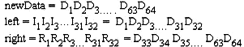

**DES算法**

**一、算法概述**

数据加密标准（Data Encryption Standard，缩写为
DES）是一种[对称密钥加密](https://zh.wikipedia.org/wiki/%E5%B0%8D%E7%A8%B1%E5%AF%86%E9%91%B0%E5%8A%A0%E5%AF%86)[块密码](https://zh.wikipedia.org/wiki/%E5%A1%8A%E5%AF%86%E7%A2%BC)算法，1976年被[美国](https://zh.wikipedia.org/wiki/%E7%BE%8E%E5%9B%BD)联邦政府的[国家标准局](https://zh.wikipedia.org/wiki/%E5%9B%BD%E5%AE%B6%E6%A0%87%E5%87%86%E5%B1%80)确定为[联邦资料处理标准](https://zh.wikipedia.org/wiki/%E8%81%94%E9%82%A6%E8%B5%84%E6%96%99%E5%A4%84%E7%90%86%E6%A0%87%E5%87%86)（FIPS），随后在国际上广泛流传开来。

DES是一种典型的块加密方法：它以64位为分组长度，64位一组的明文作为算法的输入，通过一系列复杂的操作，输出同样64位长度的密文。DES使用加密密钥定义变换过程，因此算法认为只有持有加密所用的密钥的用户才能解密密文。DES采用64位密钥，但由于每8位中的最后1位用于奇偶校验，实际有效密钥长度为56位。密钥可以是任意的56位的数，且可随时改变。其中极少量的数被认为是弱密钥，但能容易地避开它们。所有的保密性依赖于密钥。DES算法的基本过程是换位和置换。

对DES的一般讨论包括：总体结构、Feistel轮函数、子密钥生成、解密过程。

假设信息空间由{0, 1}
组成的字符串构成，明文信息和经过DES加密的密文信息是64位的分组，密钥也是64位。

   明文：M = m1m2 … m64, mi ∈{0, 1}, i = 1 .. 64.

   密文：C = c1c2 … c64, ci ∈{0, 1}, i = 1 .. 64.

   密钥：K = k1k2 … k64, ki ∈{0, 1}, i = 1 .. 64.

除去k8, k16, …, k64 共8位奇偶校验位，起作用的仅为56位。

(1) 加密过程

   C = Ek(M) = IP-1 · T16 · T15 · … · T1 · IP(M),
其中IP为初始置换，IP-1是IP的逆，T1, T2 , …, T16是一系列的迭代变换。

(2) 解密过程

M = Dk(C) = IP-1 · T1 · T2 · … · T16 · IP (C).

**二、总体结构**

>   DES算法的总体结构—Feistel结构，如下图所示


>   加密流程如下图所示


**三、模块分解**

**(1)初始置换IP**

给定64位明文块M，通过一个固定的初始置换IP来重排M中的二进制位，得到二进制串M0 = IP(M) = L0R0，这里L0和R0分别是M0的前32位和后32位。

下表给出IP置换的下标编号序列。


按照IP置换表所示把输入的64位数据的原第58位换到第1位，原第50位换到第2位，依此类推，原第7位换到第64位。最后的得到新的64位数据。

**(2)迭代T**

根据L0R0按下述规则进行16次迭代，即

>   Li = Ri-1, Ri = Li-1⊕f(Ri-1, Ki), i = 1 .. 16.

这里⊕是32位二进制串按位异或运算，f是Feistel 轮函数，16个长度为48bit的子密钥Ki (i
= 1 .. 16) 由密钥K生成16次迭代后得到L16R16，左右交换输出R16L16
。迭代T过程如下图所示


**A．Feistel轮函数f(Ri-1, Ki)**

 **a.将长度为32位的串Ri-1作E-扩展，成为48位的串E(Ri-1)。**

> E-扩展规则如图所示

 

第一次迭代以第B-2步中生成的newRata作为输入数据，第i (i \>1)次迭代以第i-1次的64位输出数据为输入数据，把64位数据按位置等分成左右两部分：     



  保持left不变，根据表6把right由32位扩展置换成48位。在数据扩展操作中，有些输入数据位（如第1、4、5、17、28、29、32……等数位）用了两次，因此数据得到了扩展。这样得到右半部分为： 


  把扩展后的48位right与第i次迭代生成的48位加密密钥进行按位异或操作形成一个新的48位的right。


**b.将E(Ri-1)和长度为48位的子密钥Ki作48位二进制串按位异或运算，Ki由密钥K生成。**

>   E(Ri-1) ⊕Ki

**c.将b得到的结果平均分成8个分组(每个分组长度6位)，分别经过8个不同的S-盒进行6-4转换，得到8个长度为4位的分组。**

S-盒是一类选择函数，用于二进制6-4 转换。Feistel 轮函数使用8个S-盒S1, …,S8,每个S-盒是一个4行(编号0-3)、16列(编号0-15)的表，表中元素是一个4位二进制数的十进制表示，取值在0-15之间。

设Si的6位输入为b1b2b3b4b5b6，则由n = (b1b6)10 确定行号，m = (b2b3b4b5)10确定列号，[Si]n,m元素的值的二进制形式即为所要的Si的输出。

>   S-盒如图所示


**d.将c得到的分组结果合并得到长度为32位的串。**

**e.将d得到的结果经过P-置换，得到Feistel轮函数f(Ri-1, Ki)的最终结果。**

>   P-置换表如图所示


P-置换操作与IP置换、E-扩展置换类似。

**B. 子密钥生成**

子密钥生成过程根据给定的64位密钥K生成Feistel轮函数的每轮中使用的子密钥Ki。
>   总体结构如图所示


**a.对K的56个非校验位实行置换PC-1，得到C0D0，其中C0和D0分别由PC-1置换后的前28位和后28位组成。i = 1。**

>   PC-1置换表如图所示


**b.计算Ci = LSi(Ci-1) 和Di = LSi(Di-1)。**

当i =1, 2, 9, 16时，LSi(A)表示将二进制串A循环左移一个位置；否则循环左移两个位置。

**c.对56位的CiDi实行PC-2压缩置换，得到48位的Ki。i = i+1。**

 PC-2压缩置换：从56位的CiDi中去掉第9, 18, 22, 25, 35, 38, 43, 54位，将剩下的48位按照PC-2置换表作置换，得到Ki。

>   PC-2置换表如图所示


**d.如果已经得到K16，密钥调度过程结束；否则转b。**

**(3)逆置换IP-1**

对迭代T输出的二进制串R16L16 使用初始置换的逆置换IP-1得到密文C，即：C = IP-1(R16L16)。原理与置换IP相同。
>IP-1置换表如图所示


**(4)解密过程**
 DES的过程设计使得用相同的函数来加密或解密每个分组成为可能。加解密过程中使用由同一个密钥K
 
经过相同的子密钥生成算法得到的子密钥序列，唯一不同之处是加解密过程中子密钥的调度次序恰好相反。

 **A.加密过程的子密钥按(K1 K2 … K15 K16)次序调度。**

 **B.解密过程的子密钥按(K16 K15 … K2 K1)次序调度。**

> 解密过程如图所示


 **四. 数据结构和类C语言算法过程**

在这次作业中，我用C++实现了DES算法。在数据结构方面，我采用了数组存储了一系列的置换表和S-Box，便于数据的访问和交换。另外在程序中调用了string和bitset两个库，其中bitset用于存储二进制数据，可使用下标访问，在IP置换和移位等操作都十分方便。下图是我编写程序的输出结果


>   以下是我编写的源代码
``` 
#include <iostream>
#include <bitset>  
#include <string>  
using namespace std;

// 初始置换IP
int IP[] = {58, 50, 42, 34, 26, 18, 10, 2,
        60, 52, 44, 36, 28, 20, 12, 4,
        62, 54, 46, 38, 30, 22, 14, 6,
        64, 56, 48, 40, 32, 24, 16, 8,
        57, 49, 41, 33, 25, 17, 9, 1,
        59, 51, 43, 35, 27, 19, 11, 3,
        61, 53, 45, 37, 29, 21, 13, 5,
        63, 55, 47, 39, 31, 23, 15, 7};

// 结尾置换IP-1 
int IP_1[] = {40, 8, 48, 16, 56, 24, 64, 32,
        39, 7, 47, 15, 55, 23, 63, 31,
        38, 6, 46, 14, 54, 22, 62, 30,
        37, 5, 45, 13, 53, 21, 61, 29,
        36, 4, 44, 12, 52, 20, 60, 28,
        35, 3, 43, 11, 51, 19, 59, 27,
        34, 2, 42, 10, 50, 18, 58, 26,
        33, 1, 41,  9, 49, 17, 57, 25}; 

// 用bitset存储密钥及子密钥
bitset<64> key;
bitset<48> subkey[16];

// PC-1置换表
int PC_1[] = {57, 49, 41, 33, 25, 17, 9,  
        1, 58, 50, 42, 34, 26, 18,  
        10,  2, 59, 51, 43, 35, 27,  
        19, 11,  3, 60, 52, 44, 36,  
        63, 55, 47, 39, 31, 23, 15,  
        7, 62, 54, 46, 38, 30, 22,  
        14,  6, 61, 53, 45, 37, 29,  
        21, 13,  5, 28, 20, 12, 4};
        

// PC-2置换表
int PC_2[] = {14, 17, 11, 24,  1,  5,  
        3, 28, 15,  6, 21, 10,  
        23, 19, 12,  4, 26,  8,  
        16,  7, 27, 20, 13,  2,  
        41, 52, 31, 37, 47, 55,  
        30, 40, 51, 45, 33, 48,  
        44, 49, 39, 56, 34, 53,  
        46, 42, 50, 36, 29, 32};  

// E扩展置换表
int E[] = {32,  1,  2,  3,  4,  5,  
        4,  5,  6,  7,  8,  9,  
        8,  9, 10, 11, 12, 13,  
        12, 13, 14, 15, 16, 17,  
        16, 17, 18, 19, 20, 21,  
        20, 21, 22, 23, 24, 25,  
        24, 25, 26, 27, 28, 29,  
        28, 29, 30, 31, 32, 1};

// 8个S盒 
int S_BOX[8][4][16] = {  
        {    
            {14, 4, 13, 1, 2, 15, 11, 8, 3, 10, 6, 12, 5, 9, 0, 7},    
            {0, 15, 7, 4, 14, 2, 13, 1, 10, 6, 12, 11, 9, 5, 3, 8},    
            {4, 1, 14, 8, 13, 6, 2, 11, 15, 12, 9, 7, 3, 10, 5, 0},   
            {15, 12,8,2,4,9,1,7,5,11,3,14,10,0,6,13}   
        },  
        {    
            {15, 1, 8, 14, 6, 11, 3, 4, 9, 7, 2, 13, 12, 0, 5, 10},    
            {3, 13, 4, 7, 15, 2, 8, 14, 12, 0, 1, 10, 6, 9, 11, 5},   
            {0, 14, 7, 11, 10, 4, 13, 1, 5, 8, 12, 6, 9, 3, 2, 15},    
            {13, 8, 10, 1, 3, 15, 4, 2, 11, 6, 7, 12, 0, 5, 14, 9}    
        },   
        {    
            {10, 0, 9, 14, 6, 3, 15, 5, 1, 13, 12, 7, 11, 4, 2, 8},    
            {13, 7, 0, 9, 3, 4, 6, 10, 2, 8, 5, 14, 12, 11, 15, 1},    
            {13, 6, 4, 9, 8, 15, 3, 0, 11, 1, 2, 12, 5, 10, 14, 7},    
            {1, 10, 13, 0, 6, 9, 8, 7, 4, 15, 14, 3, 11, 5, 2, 12}    
        },   
        {    
            {7, 13, 14, 3, 0, 6, 9, 10, 1, 2, 8, 5, 11, 12, 4, 15},    
            {13, 8, 11, 5, 6, 15, 0, 3, 4, 7, 2, 12, 1, 10, 14, 9},    
            {10, 6, 9, 0, 12, 11, 7, 13, 15, 1, 3, 14, 5, 2, 8, 4},    
            {3, 15, 0, 6, 10, 1, 13, 8, 9, 4, 5, 11, 12, 7, 2, 14}    
        },  
        {    
            {2, 12, 4, 1, 7, 10, 11, 6, 8, 5, 3, 15, 13, 0, 14, 9},    
            {14, 11, 2, 12, 4, 7, 13, 1, 5, 0, 15, 10, 3, 9, 8, 6},    
            {4, 2, 1, 11, 10, 13, 7, 8, 15, 9, 12, 5, 6, 3, 0, 14},    
            {11, 8, 12, 7, 1, 14, 2, 13, 6, 15, 0, 9, 10, 4, 5, 3}    
        },  
        {    
            {12, 1, 10, 15, 9, 2, 6, 8, 0, 13, 3, 4, 14, 7, 5, 11},    
            {10, 15, 4, 2, 7, 12, 9, 5, 6, 1, 13, 14, 0, 11, 3, 8},    
            {9, 14, 15, 5, 2, 8, 12, 3, 7, 0, 4, 10, 1, 13, 11, 6},    
            {4, 3, 2, 12, 9, 5, 15, 10, 11, 14, 1, 7, 6, 0, 8, 13}    
        },   
        {    
            {4, 11, 2, 14, 15, 0, 8, 13, 3, 12, 9, 7, 5, 10, 6, 1},    
            {13, 0, 11, 7, 4, 9, 1, 10, 14, 3, 5, 12, 2, 15, 8, 6},    
            {1, 4, 11, 13, 12, 3, 7, 14, 10, 15, 6, 8, 0, 5, 9, 2},    
            {6, 11, 13, 8, 1, 4, 10, 7, 9, 5, 0, 15, 14, 2, 3, 12}    
        },   
        {    
            {13, 2, 8, 4, 6, 15, 11, 1, 10, 9, 3, 14, 5, 0, 12, 7},    
            {1, 15, 13, 8, 10, 3, 7, 4, 12, 5, 6, 11, 0, 14, 9, 2},    
            {7, 11, 4, 1, 9, 12, 14, 2, 0, 6, 10, 13, 15, 3, 5, 8},    
            {2, 1, 14, 7, 4, 10, 8, 13, 15, 12, 9, 0, 3, 5, 6, 11}    
        }   
};  

// P置换表
int P[] = {16,  7, 20, 21,  
        29, 12, 28, 17,  
        1, 15, 23, 26,  
        5, 18, 31, 10,  
        2, 8, 24, 14,  
        32, 27, 3, 9,  
        19, 13, 30, 6,  
        22, 11, 4, 25}; 

/** 
 *  字符串转二进制数 
 */
bitset<64> string_to_bitset(string s) {
    bitset<64> binary_code;
    // 默认字符串长度为8，将字符串转换成64位二进制数
    for (unsigned i = 0; i < s.size(); ++i) {
        for (int j = 0; j < 8; ++j) {
            binary_code[i * 8 + j] = (s[i] >> j) & 1;
        }
    }
    return binary_code;
}


/** 
 *  输入明文转换 
 */
bitset<64> input_clear_text(string string_clear_text) {
    // 规定明文有8个字符
    // 将明文转换成64位二进制数
    return string_to_bitset(string_clear_text);
}

/** 
 *  输入密钥转换 
 */
bitset<64> input_key(string string_key) {
    // 规定密钥有8个字符
    // 将密钥转换成64位二进制数
    return string_to_bitset(string_key);
}

/** 
 *  IP置换
 */
bitset<64> IP_permutation(bitset<64> clear_text) {
    bitset<64> permutated_text;
    // 对二进制明文进行IP置换
    for (int i = 0; i < 64; ++i) {
        permutated_text[63 - i] = clear_text[64 - IP[i]];
    }
    return permutated_text;
}

/** 
 *  循环左移 
 */
bitset<28> LS(bitset<28> A, int i) {
    bitset<28> new_set;
    // 将二进制串A循环左移
    int shift_bits = 2;
    if (i == 1 || i == 2 || i == 9 || i == 16) {
        shift_bits = 1;
    } 
    for (int j = 27; j >= 0; --j) {
        if (j - shift_bits < 0) {
            new_set[j] = A[j - shift_bits + 28];
        }
        else {
            new_set[j] = A[j - shift_bits];
        }
    }
    return new_set;
}

/** 
 *  生成16个48位的子密钥 
 */
void subkey_generation(bitset<64> key) {
    bitset<56> reduced_key;
    bitset<28> C, D;
    bitset<48> compressed_key; 
    // 对密钥K的56个非校验位实行置换PC_1
    for (int i = 0; i < 56; ++i) {
        reduced_key[55 - i] = key[64 - PC_1[i]];
    }
    // 进行16轮迭代
    for (int i = 0; i < 16; ++i) {
        // 得到Ci和Di
        for (int j = 0; j < 28; ++j) {
            C[j] = reduced_key[j];
        }
        for (int j = 28; j < 56; ++j) {
            D[j - 28] = reduced_key[j];
        }
        // 对Ci和Di进行循环左移
        C = LS(C, i);
        D = LS(D, i);
        for (int j = 28; j < 56; ++j) {
            reduced_key[j] = C[j - 28];
        }
        for (int j = 0; j < 28; ++j) {
            reduced_key[j] = D[j];
        }
        // 对CiDi实行PC-2压缩置换
        for (int j = 0; j < 48; ++j) {
            compressed_key[47 - j] = reduced_key[56 - PC_2[j]];
        }
        subkey[i] = compressed_key;
    }
}

/** 
 *  Feistel轮函数 
 */
bitset<32> f(bitset<32> R, bitset<48> K) {
    // 将32位的串R进行E扩展成为48位的串E(R)
    bitset<48> E_expand;
    for (int i = 0; i < 48; ++i) {
        E_expand[47 - i] = R[32 - E[i]];
    }
    // 将E(R)和长度为48位的子密钥K进行48位二进制异或运算
    E_expand ^= K;
    // 将结果分成8个分组
    bitset<6> group[8];
    for (int i = 0; i < 8; ++i) {
        for (int j = 0; j < 6; ++j) {
            group[7 - i][5 - j] = E_expand[47 - 6 * i - j];
        }
    }
    // 经过S盒作6-4转换且合并结果
    bitset<32> output;
    for (int i = 7; i >= 0; --i) {
        int n = group[i][5] * 2 + group[i][0];
        int m = group[i][4] * 8 + group[i][3] * 4 + group[i][2] * 2 + group[i][1];
        int num = S_BOX[7 - i][n][m];
        bitset<4> binary(num);
        for (int j = 0; j < 4; ++j) {
            output[31 - i * 4 - j] = binary[j];
        }
    }
    // 对输出结果进行P置换
    bitset<32> temp = output;
    for (int i = 0; i < 32; ++i) {
        output[31 - i] = temp[32 - P[i]];
    }  
    return output;
}

/** 
 *  16轮迭代T(加密时用) 
*/
bitset<64> T(bitset<64> permutated_text) {
    bitset<32> L, R;
    bitset<64> iterated_text;
    // 获取Li和Ri  
    for (int i = 32; i < 64; ++i) {
        L[i - 32] = permutated_text[i];
    }
    for (int i = 0; i < 32; ++i) {
        R[i] = permutated_text[i];
    }
    // 进行16次T迭代
    for (int i = 0; i < 16; ++i) {  
        bitset<32> temp = R;  
        R = L ^ f(R, subkey[i]);  
        L = temp;  
    }  
    //合并L和R为RL  
    for (int i = 0; i < 32; ++i) {
        iterated_text[i] = L[i];
    }
    for (int i = 32; i < 64; ++i) {
        iterated_text[i] = R[i - 32];
    }
    return iterated_text;
}

/** 
 *  16轮迭代T(解密时用) 
*/
bitset<64> inverse_T(bitset<64> permutated_text) {
    bitset<32> L, R;
    bitset<64> iterated_text;
    // 获取Li和Ri  
    for (int i = 32; i < 64; ++i) {
        L[i - 32] = permutated_text[i];
    }
    for (int i = 0; i < 32; ++i) {
        R[i] = permutated_text[i];
    }
    // 进行16次T迭代
    for (int i = 0; i < 16; ++i) {  
        bitset<32> temp = R;  
        R = L ^ f(R, subkey[15 - i]);  
        L = temp;  
    }  
    //合并L和R为RL  
    for (int i = 0; i < 32; ++i) {
        iterated_text[i] = L[i];
    }
    for (int i = 32; i < 64; ++i) {
        iterated_text[i] = R[i - 32];
    }
    return iterated_text;
}

/** 
 *  逆置换IP-1 
*/
bitset<64> IP_1_permutation(bitset<64> iterated_text) {
    bitset<64> cipher_text;
    // 进行逆IP置换
    for (int i = 0; i < 64; ++i) {
        cipher_text[63 - i] = iterated_text[64 - IP_1[i]];
    }
    return cipher_text;
}

/** 
 *  加密函数 
*/
bitset<64> encrypt(bitset<64>& clear_text) {
    // 初始置换IP
    bitset<64> permutated_text = IP_permutation(clear_text);
    // 16轮迭代T
    bitset<64> iterated_text = T(permutated_text);
    // 结尾置换IP-1
    bitset<64> cipher_text = IP_1_permutation(iterated_text);
    return cipher_text;
}

/** 
 *  解密函数 
*/
bitset<64> decrypt(bitset<64>& cipher_text) {  
    // 初始置换IP
    bitset<64> permutated_text = IP_permutation(cipher_text);
    // 16轮迭代T
    bitset<64> iterated_text = inverse_T(permutated_text);
    // 结尾置换IP-1
    bitset<64> clear_text = IP_1_permutation(iterated_text);
    return clear_text;  
}

/** 
 *  二进制数转字符串 
*/
string binary_to_string(bitset<64> binary) {
    string text;
    for (int i = 0; i < 64; i += 8) {
        bitset<8> temp;
        for (int j = 0; j < 8; ++j) {
            temp[j] = binary[i + j];
        }
        text += char(temp.to_ulong());
    }
    return text;
}

/** 
 *  测试程序 
*/
int main() {
    // 输入明文和密钥
    string string_clear_text;
    string string_key;
    cout << "Please input the text you want to encrypt :" << endl;
    cin >> string_clear_text;
    cout << "Please input the key you want to use :" << endl;
    cin >> string_key;
    // 生成子密钥
    key = input_key(string_key);
    subkey_generation(key);
    // 明文转换成二进制数形式
    bitset<64> binary_clear_text = input_clear_text(string_clear_text);
    cout << "The binary form of the encrypted text is :" << endl;
    cout << binary_clear_text << endl;
    // 对明文进行加密
    bitset<64> binary_cipher_text = encrypt(binary_clear_text);
    cout << "The binary form of the cipher text is :" << endl;
    cout << binary_cipher_text << endl;
    // 密文转换成字符串
    cout << "The string form of the cipher text is :" << endl;
    cout <<  binary_to_string(binary_cipher_text) << endl;
    // 对密文进行解密
    bitset<64> decrypted_cipher_text = decrypt(binary_cipher_text);
    cout << "The binary form of the decrypted text is :" << endl;
    cout << decrypted_cipher_text << endl;
    // 解密后的明文转换成字符串
    cout << "The string form of the decrypted text is :" << endl;
    cout <<  binary_to_string(decrypted_cipher_text) << endl;
    return 0;
}

```